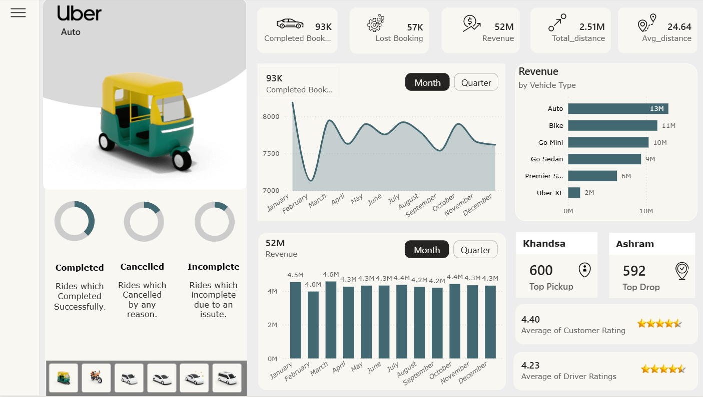
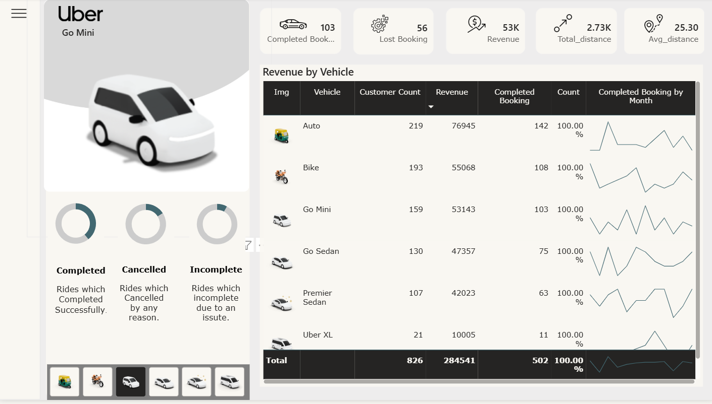
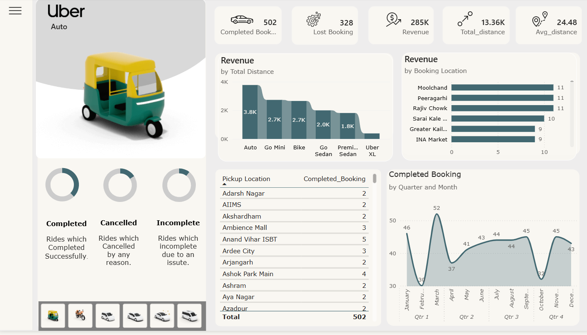

# 🚗 Uber Ride Analytics Dashboard


An interactive **Power BI dashboard** designed to analyze Uber ride data, uncover trends, and generate actionable business insights across revenue, ride demand, customer behavior, and operational performance.

## 📊 Overview

This project transforms raw ride data into meaningful visual insights through interactive dashboards and KPI-driven analysis.

### Focus Areas
- Ride demand trends over time
- Revenue distribution by vehicle type
- Customer & driver behavior analysis
- Cancellation pattern tracking
- Location-based performance insights

## ❓ Problem Statement

Ride-hailing platforms often face challenges in:
- Identifying peak booking periods
- Understanding cancellation behavior
- Tracking revenue contribution across services
- Monitoring operational performance by location

This dashboard addresses these issues using data-driven analytics and visualization.

## 📌 Key Insights

- 🚕 Auto & Bike contribute the highest revenue
- 📍 Certain locations dominate ride demand
- ❌ Cancellation trends reveal operational inefficiencies
- 📅 Monthly patterns highlight peak and low-demand periods

## 📷 Dashboard Preview

### Overview Dashboard


### Vehicle Analysis


### Location Insights


## ⚙️ Tools & Technologies

- Power BI
- Excel
- DAX (Data Analysis Expressions)

## 🚀 Features

- Interactive filters (Month, Quarter, Vehicle Type)
- Revenue, Distance & Booking KPIs
- Location-based ride analysis
- Customer & driver behavior tracking
- Dynamic visual insights

## 📁 Project Structure

```bash
📦 Uber-Analytics-Dashboard
├── dashboard/
│   └── Uber_Dashboard.pbix
├── data/
│   └── dataset.xlsx
├── images/
│   ├── overview.png
│   ├── vehicle.png
│   ├── location.png
│   └── customer.png
